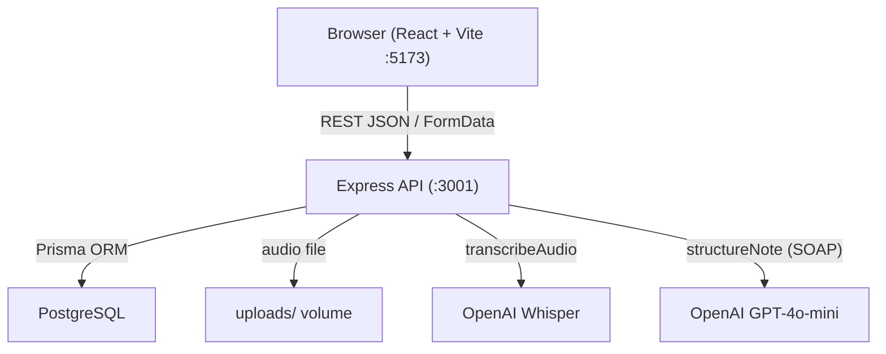

# lime-scriber

AI Scribe Notes Management Tool — a full-stack Lime takehome app for creating, listing, and viewing clinical notes. Clinicians can enter notes as text or upload audio; the API transcribes audio with OpenAI Whisper and optionally structures notes into SOAP format with GPT-4o-mini. A React web UI covers note list, detail (with patient sidebar), and create-note flows.

## Prerequisites

- Docker and Docker Compose
- Node.js 22 (optional, for local development without Docker)
- OpenAI API key (required for audio transcription; optional for SOAP structuring on text notes)

## Quick start (Docker)

```bash
cp .env.example .env
# Edit .env and set OPENAI_API_KEY for audio notes and SOAP structuring
docker compose up --build
```

| Service | URL |
|---------|-----|
| Web app | http://localhost:5173 |
| API health | http://localhost:3001/health |
| API patients | http://localhost:3001/patients |
| Notes UI | http://localhost:5173/notes |

The browser runs on your host, so `VITE_API_URL` must point to `http://localhost:3001` (the mapped API port), not the internal Docker hostname `api`.

PostgreSQL is only reachable inside the Docker network (port 5432 is not published to the host, to avoid conflicts with a local Postgres instance). The API connects via the hostname `postgres`.

On first start, the API container runs Prisma migrations and seeds three mock patients.

## Local development (without Docker)

1. Start PostgreSQL and set `DATABASE_URL` in `.env` (use `localhost` instead of `postgres`).
2. Install dependencies: `npm install`
3. Migrate and seed: `npm run db:migrate && npm run db:seed`
4. Run API and web: `npm run dev`

## Workspace scripts

| Script | Description |
|--------|-------------|
| `npm run dev` | Run API and web concurrently |
| `npm run docker:up` | Build and start all Docker services |
| `npm run docker:down` | Stop Docker services |
| `npm run db:migrate` | Run Prisma migrations (API workspace) |
| `npm run db:seed` | Seed mock patients (API workspace) |

## API reference

Base URL: `http://localhost:3001` (Docker or local API).

| Method | Path | Body / Params | Response |
|--------|------|---------------|----------|
| GET | `/health` | — | `{ status: "ok" }` |
| GET | `/patients` | — | `Patient[]` |
| GET | `/patients/:id` | path `id` | `Patient` or `404` |
| POST | `/notes` | JSON `{ patientId, inputType: "TEXT", rawInput }` **or** multipart `patientId`, `inputType: "AUDIO"`, file field `audio` | `Note` (201) |
| GET | `/notes` | — | `NoteListItem[]` (newest first) |
| GET | `/notes/:id` | path `id` | `NoteDetail` or `404` |

### Response shapes (summary)

**`Patient`:** `{ id, externalId, fullName, dateOfBirth, createdAt }`

**`NoteListItem`:** `{ id, preview, createdAt, inputType, patient: { id, fullName } }`

**`NoteDetail`:** `{ id, transcription, processedContent, inputType, rawInput, createdAt, patient: { id, externalId, fullName, dateOfBirth } }`

**`Note` (create response):** `{ id, inputType, rawInput, transcription, processedContent, preview, createdAt, patient: { id, fullName } }`

### Create a text note

```bash
curl -X POST http://localhost:3001/notes \
  -H "Content-Type: application/json" \
  -d '{"patientId":"<patient-id>","inputType":"TEXT","rawInput":"Patient reports mild headache for two days."}'
```

### Create an audio note

Requires `OPENAI_API_KEY`. Audio is stored under `apps/api/uploads/` (Docker uses named volume `uploads_data`).

```bash
curl -X POST http://localhost:3001/notes \
  -F "patientId=<patient-id>" \
  -F "inputType=AUDIO" \
  -F "audio=@/path/to/recording.mp3"
```

## Environment variables

| Variable | Required | Description |
|----------|----------|-------------|
| `DATABASE_URL` | Yes | PostgreSQL connection string |
| `OPENAI_API_KEY` | For audio | OpenAI API key for Whisper transcription and SOAP structuring; audio requests return `503` if unset |
| `PORT` | No | API port (default `3001`) |
| `CORS_ORIGIN` | No | Allowed browser origin (default `http://localhost:5173`) |
| `VITE_API_URL` | No | API base URL for the web app (default `http://localhost:3001`) |

Copy `.env.example` to `.env` and adjust values for your environment.

## Architecture



**Monorepo layout:** `apps/api` (Express, Prisma, OpenAI services) and `apps/web` (Vite + React + React Router). Shared npm workspaces at the repo root.

## Assumptions and shortcuts

- **Audio storage:** Files are stored locally under `apps/api/uploads/`. Production would use object storage (e.g. S3) with signed URLs.
- **Authentication:** None — all API endpoints are public. A real deployment would add JWT or session auth and tenant scoping.
- **SOAP structuring:** Best-effort via GPT-4o-mini after transcription. If OpenAI fails, the note is still saved with `processedContent: null`.
- **Testing:** No automated test suite; behavior was verified manually via the web UI and `curl`.
- **With more time:** S3 for audio, auth middleware, Vitest unit tests for services, production nginx multi-stage web Dockerfile, `DELETE /notes/:id`, and structured error logging/metrics.
